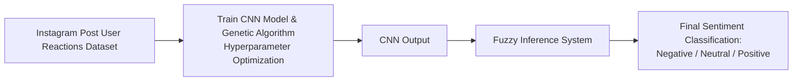

# AI Training Workflow

## Project Description

This project analyzes sentiment on Instagram-post reaction images. The system classifies each image into three categories based on the filename label and the trained model output: negative, neutral, or positive.

The model workflow is illustrated below:



## Group Profile

- Francisco Gilbert Sondakh - 140810230004
- Wilson Angelie Tan - 140810230024
- Theophilus Samuel Ghozali - 140810230054

## Setup

This project uses `uv` for dependency management.

If `uv` is not installed yet, run this PowerShell command:

```powershell
powershell -ExecutionPolicy ByPass -c "irm https://astral.sh/uv/install.ps1 | iex"
```

After `uv` is installed, synchronize the project dependencies:

```powershell
uv sync
```

## Run the Project

This training workflow is notebook-based. Open the notebook below and run the cells in order:

```powershell
jupyter notebook notebook/main.ipynb
```

If you prefer JupyterLab, you can also run:

```powershell
jupyter lab notebook/main.ipynb
```

The notebook expects dataset images inside `dataset/` and reads the class label from each filename suffix:

- `*_neg.*` for `Negative`
- `*_neutral.*` for `Neutral`
- `*_pos.*` for `Positive`
